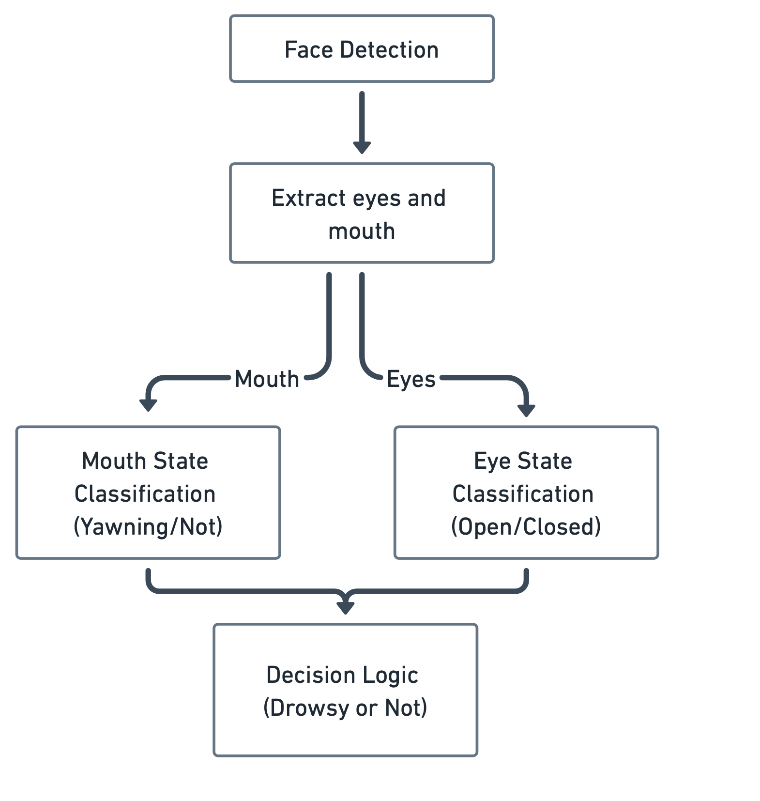

# Real-Time Driver Drowsiness Detection System

## Project Overview
This system detects driver drowsiness in real-time using computer vision and deep learning techniques to enhance road safety and prevent accidents caused by driver fatigue.

## Key Features
- Real-time facial feature detection and tracking
- Eye state classification (open/closed)
- Mouth state analysis for yawning detection
- Multi-level drowsiness state classification
- Alert system for drowsy driving prevention
- Optimized for Jetson Nano deployment

## System Architecture
The system follows a modular design:
1. **Face Detection**: Identifies and isolates the driver's face in video frames
2. **Feature Extraction**: Extracts eye and mouth regions from detected face
3. **State Classification**: Classifies eye state (open/closed) and mouth state (yawning/not)
4. **Decision Logic**: Combines classifications to determine overall drowsiness state
5. **Alert System**: Triggers audio alerts when drowsiness is detected



## Repository Structure
```bash
.
├── assets/             # Resource files (audio alerts, images)
├── datasets/           # Training and testing datasets
├── docs/               # Documentation and research materials
├── hardware/           # Hardware setup for deployment (Jetson Nano)
├── logs/               # System and evaluation logs
├── notebooks/          # Jupyter notebooks for development and analysis
├── reports/            # Project reports and presentations
├── scripts/            # Utility scripts for training, preprocessing, and evaluation
├── src/                # Main source code
│   ├── data/           # Data processing modules
│   ├── detection/      # Feature detection algorithms
│   ├── evaluation/     # System evaluation tools
│   ├── models/         # Machine learning models
│   ├── utils/          # Utility functions
│   └── visualization/  # Visualization components
└── tests/              # System and component tests
```

## Getting Started


### Installation
```bash
# Clone the repository
git clone https://github.com/yourusername/Real-Time-Driver-Drowsiness-Detection.git
cd Real-Time-Driver-Drowsiness-Detection

# Install dependencies
pip install -r requirements.txt
```

### Usage
Run the main drowsiness detection system:
```bash
python src/main.py
```


## Technical Details
The system uses CNNs for eye and mouth state classification, with models trained on specialized datasets. The face detection module employs computer vision techniques to identify facial regions, while the decision logic combines signals from multiple classifiers to determine drowsiness state with high accuracy.

Processing is optimized for real-time performance on the Jetson Nano (25+ FPS at 1280x720 resolution), balancing accuracy and computational efficiency.

## Contributors
- Ahmed Alkhulayfi
- Badr Alhomaidhi
- Yazeed Alajaji
- Abdurahman Almuhammad

## License
[Specify your license here]

## Documentation
Refer to the `docs/` directory for detailed documentation:
- `research_survey.md`: Background research and literature review
- `system_design.md`: System architecture and component design
- `user_guide.md`: Instructions for using the system

## Acknowledgments
[Add any acknowledgments here]
