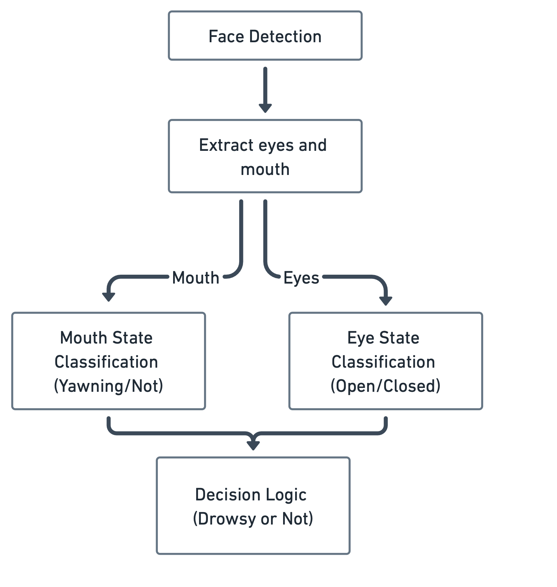

# Source Code Directory

This directory contains the core implementation of the Real-Time Driver Drowsiness Detection system, which uses computer vision and deep learning techniques to monitor driver alertness.

## System Architecture

The system follows a modular pipeline architecture:




1. **Face Detection**: Locates and extracts the driver's face in each video frame
2. **Feature Extraction**: Extracts eye and mouth regions using facial landmarks
3. **State Classification**: Classifies eye state (open/closed) and mouth state (yawning/not)
4. **Decision Logic**: Combines classification results to determine drowsiness state

## Key Components

### Detection System

- **Camera Module** (`detection/camera_module.py`): Handles video capture and frame processing
- **Face Detection** (`detection/face_detection.py`): Uses MediaPipe to detect and isolate face regions
- **Feature Extraction** (`detection/feature_extraction.py`): Extracts facial landmarks and feature regions (eyes, mouth)
- **State Classification** (`detection/state_classification.py`): Classifies eye and mouth states using CNN models
- **Decision Logic** (`detection/decision_logic.py`): Combines eye and mouth states to determine drowsiness
- **Tracker** (`detection/tracker.py`): Implements temporal tracking of drowsiness states using sliding window
- **Alarm System** (`detection/alarm_system.py`): Triggers audible alerts for drowsiness and distraction
- **Facial Measurement** (`detection/facial_measurement.py`): Calculates EAR (Eye Aspect Ratio) and MAR (Mouth Aspect Ratio)
- **Head Pose Estimator** (`detection/head_pose_estimator.py`): Detects head orientation for distraction monitoring
- **Calibration** (`detection/calibration.py`): User-specific calibration of detection thresholds

### Models

- **CNN Models** (`models/cnn_model.py`): Custom CNN architectures for eye and mouth state classification
- **Model Training**: Notebooks for model training are in the notebooks directory

### Visualization

- **Real-time Display** (`visualization/plot_results.py`): Visualizes detection results with status overlays
- **Real-time Plotting** (`visualization/realtime_plotter.py`): Plots EAR and MAR values in real-time

### Utilities

- **Helper Functions** (`utils/utils.py`): Dataset organization, image processing, and analysis tools
- **Metrics** (`utils/metrics.py`): Evaluation metrics for model performance

## Core Algorithm

The system works by:

1. Capturing video frames from a camera
2. Detecting the driver's face using MediaPipe Face Detection
3. Extracting facial landmarks with MediaPipe Face Mesh
4. Calculating EAR and MAR values from landmarks
5. Using CNN models to classify eye and mouth states
6. Applying decision logic to determine drowsiness based on:
   - Both eyes being closed (high confidence)
   - Yawning detection
   
7. Tracking drowsiness over time using a sliding window approach
8. Triggering alerts when sustained drowsiness is detected

## Configuration

The system uses a central configuration class (`detection/config.py`) that controls:

- Camera settings (resolution, capture device)
- Detection thresholds (EAR, MAR, confidence thresholds)
- Model paths and parameters
- Temporal window sizes
- Alarm settings

## Usage

The main entry point is `detection/main.py`, which initializes and runs the complete drowsiness detection pipeline:

```python
# Run the drowsiness detection system
python -m src.detection.main
```

## Dependencies

Main dependencies include:
- OpenCV (camera access and image processing)
- MediaPipe (face and landmark detection)
- PyTorch (deep learning models)
- NumPy (numerical operations)
- Matplotlib (visualization) 