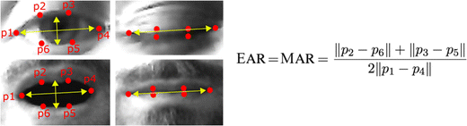

# Detection Module

This directory contains the core components of the drowsiness detection pipeline, implementing the algorithms for face detection, feature extraction, and drowsiness classification.

## Components

### Camera Module (`camera_module.py`)
Handles video capture from the camera device:
- Initializes and manages camera connection (defaulting to camera index 0)
- Captures and preprocesses video frames (1280x720 resolution)
- Converts frames from BGR to RGB color space

### Face Detection (`face_detection.py`)
Detects and isolates the driver's face in each frame:
- Uses MediaPipe Face Detection with customizable confidence threshold (default 0.5)
- Extracts face region with configurable padding percentage (default 20%)
- Returns face image region and detection confidence in a `FaceRegion` container

### Feature Extraction (`feature_extraction.py`)
Processes detected faces to extract facial landmarks and regions of interest:
- Uses MediaPipe Face Mesh to extract facial landmarks
- Extracts left eye, right eye, and mouth regions with padding
- Provides specific landmark coordinates for EAR calculation:
  - Left eye landmarks: 362, 385, 387, 263, 373, 380
  - Right eye landmarks: 33, 160, 158, 133, 153, 144
- Provides specific landmark coordinates for MAR calculation:
  - Mouth landmarks: 61, 291, 39, 181, 0, 17, 269, 405
- Returns extracted regions and landmarks in a `FacialFeatures` container


### State Classification (`state_classification.py`)
Classifies the states of facial features using deep learning models:
- Uses custom CNN models loaded from specified paths
- Resizes inputs to 128x128 pixels for model processing
- Classifies eye state as Open (1) or Closed (0)
- Classifies mouth state as No Yawn (0) or Yawn (1)
- Returns classifications with confidence scores in a `StateResults` container

### Decision Logic (`decision_logic.py`)
Makes the final drowsiness determination based on multiple inputs:
- Analyzes 8 different scenarios based on eye and mouth states
- Decision table:
  ```
  | Scenario | Left Eye | Right Eye | Mouth    | Interpretation                      |
  |----------|----------|-----------|----------|-------------------------------------|
  | 1        | Open     | Open      | No Yawn  | Driver is alert                     |
  | 2        | Open     | Open      | Yawn     | Early sign of drowsiness or fatigue |
  | 3        | Closed   | Open      | No Yawn  | Possible blinking or obstruction    |
  | 4        | Closed   | Open      | Yawn     | Potential fatigue, needs monitoring |
  | 5        | Open     | Closed    | No Yawn  | Possible blinking or obstruction    |
  | 6        | Open     | Closed    | Yawn     | Potential fatigue, needs monitoring |
  | 7        | Closed   | Closed    | No Yawn  | High chance of drowsiness           |
  | 8        | Closed   | Closed    | Yawn     | Strong indicator of drowsiness      |
  ```
- Returns drowsiness state, eye status, yawn status, confidence, and head pose status in a `DecisionResult` container

### Facial Measurement (`facial_measurement.py`)
Calculates geometric ratios to measure eye and mouth states:
- Computes Eye Aspect Ratio (EAR) with formula: `(vertical_distances) / (2.0 * horizontal_distance)`
- Calculates Mouth Aspect Ratio (MAR) with similar approach
- Tracks blink count when EAR transitions from below threshold to above
- Tracks yawn count when MAR transitions from above threshold to below
- Calculates blink and yawn rates (events per second)
- Returns all metrics in a `FacialMetrics` container

<div style="text-align: center;">
    
</div>


### Head Pose Estimator (`head_pose_estimator.py`)
Estimates the driver's head orientation:
- Uses camera matrix based on focal length and image dimensions
- Solves Perspective-n-Point (PnP) problem to get rotation vector
- Converts rotation vector to Euler angles (pitch, yaw, roll)
- Returns head pose angles in degrees

### Tracker (`tracker.py`)
Implements temporal tracking of drowsiness states:
- Maintains fixed-size deques for drowsiness and head pose states
- Uses configurable window sizes (default 70 frames for drowsiness)
- Triggers alert when drowsy frames exceed threshold percentage (default 80%)
- Monitors head pose with separate deque and threshold (default 80%)
- Clears buffers after triggering to prevent repeated alerts

### Alarm System (`alarm_system.py`)
Manages the alert system for drowsiness and distraction:
- Uses three different sound files for different alerts:
  - Drowsiness alarm
  - Distraction alarm
  - Face not detected alarm
- Plays sounds in a separate thread to avoid blocking the main process
- Prevents triggering multiple overlapping alarms

### Calibration (`calibration.py`)
Provides personalized calibration for different users:
- Guides user through four calibration steps:
  1. Open mouth widely (collect yawning samples)
  2. Close eyes (collect closed eye samples)
  3. Open eyes (collect open eye samples)
  4. Close mouth (collect normal mouth samples)
- Collects confidence scores from multiple frames for each state
- Calculates new threshold values as 90% of the midpoint between states
- Updates system config with personalized thresholds

### Configuration (`config.py`)
Central configuration for the entire system:
- Camera settings: index, resolution
- Face detection parameters: confidence threshold, padding
- Feature extraction: landmark detection settings
- Model paths: eye and mouth state models
- Classification thresholds: eye, mouth, and confidence thresholds
- Alarm settings: sound file paths
- Temporal analysis: window sizes and thresholds
- Facial measurement thresholds: EAR  and MAR 

## Main Pipeline (`main.py`)

The main execution flow:
1. Load and validate configuration
2. Initialize all system components
3. Run user-specific calibration process
4. Set up video recording if enabled
5. Enter main detection loop:
   - Capture frame from camera
   - Detect face in frame
   - If face detected:
     - Extract facial features
     - Calculate facial measurements (EAR/MAR)
     - Classify eye and mouth states
     - Determine drowsiness state
     - Track drowsiness over time
     - Trigger alarms if threshold exceeded
   - Display results with visual indicators
6. Clean up resources on exit

## Requirements
The module requires several Python packages as listed in `requirements.txt`:
- opencv-python - For image processing and camera access
- mediapipe - For face detection and landmark extraction
- torch - For running the CNN models
- torchvision - For image transformations
- numpy - For numerical operations
- playsound - For playing alert sounds
- matplotlib - For visualization

