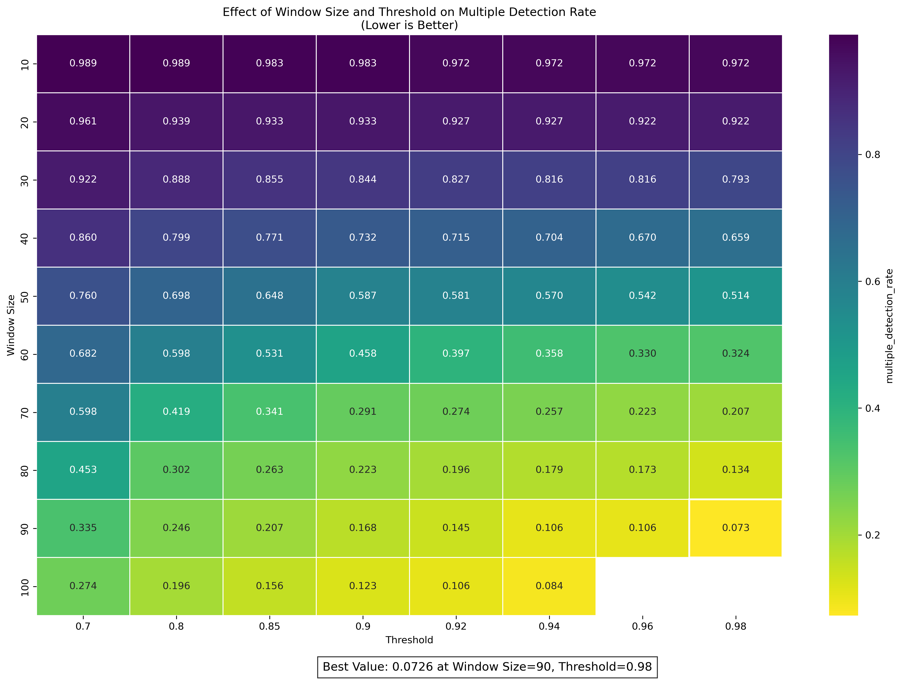

# Drowsiness Detection System Parameter Optimization Report

## 1. Overview

This report summarizes the findings from parameter optimization experiments for the drowsiness detection system. We evaluated 78 different configurations varying window size and threshold parameters to identify the optimal settings for maximizing accuracy while minimizing multiple detection rate.

## 2. Methodology

- **Parameters Tested:**
  - Window Size: Values from 10 to 100
    - [10, 20, 30, 40, 50, 60, 70, 80, 90, 100] 
  - Threshold: Values from 0.7 to 0.98
    - [0.7, 0.8, 0.85, 0.9, 0.92, 0.94, 0.96, 0.98]
  
- **Key Metrics:**
  - Accuracy: Percentage of correctly classified videos (higher is better)
  - Multiple Detection Rate (MDR): Proportion of drowsy videos with multiple detections (lower is better)
    - **Importance of MDR**: 
        - Too many alerts for the same drowsiness event annoys drivers
        - Annoyed drivers may turn off the safety system
        - Multiple detections make it harder to count actual drowsiness events
        - A good system should alert once per drowsiness event, not repeatedly
        - Lower MDR means better user experience and system effectiveness
  - False Positive Rate: Rate of false drowsiness detections in non-drowsy videos
  - Average Detection Latency: Time to detect drowsiness in drowsy videos
  
- **Evaluation Setup:**
  - 341 total test videos
    - 179 drowsy videos
    - 162 non-drowsy videos
  - 12,055,680 frames processed across all configurations (≈154,560 frames per configuration)
    - Equivalent to approximately 111.6 hours of video at 30fps
  - Data collected across 78 parameter combinations
    - Note: While a full grid search would yield 80 combinations, testing for window size 100 was limited to 6 threshold values after observing consistent accuracy degradation at larger window sizes
- **Dataset**
    - Dataset available at: [Video Dataset](https://drive.google.com/file/d/1XeAWdLl9Aop3zIkiJdXUdgxANMuBrEoB/view?usp=share_link)
        - Dataset preparation:
            - Original source videos often contained multiple drowsiness events in a single recording
            - We isolated and extracted individual drowsiness events into separate videos to create clean, labeled test cases
            - This preprocessing step ensures that each video contains exactly one drowsiness event or none, allowing for precise measurement of multiple detection rates
        - Datasets used:
            - [YAWDD Dataset](https://www.kaggle.com/datasets/enider/yawdd-dataset/data): Videos of drivers in various driving scenarios with drowsiness events
            - [NITYMED Dataset](https://www.kaggle.com/datasets/nikospetrellis/nitymed): Collection of facial recordings in different lighting conditions
            - [UTA Real-Life Drowsiness Dataset](https://www.kaggle.com/datasets/rishab260/uta-reallife-drowsiness-dataset): Real-world drowsiness recordings in diverse environments

## 3. Analysis of Window Size Effect

The window size parameter significantly impacts both accuracy and multiple detection rate:

- **Effect on Accuracy:**
  - Smaller window sizes (10-30) have lower accuracy that rapidly improves with increasing window size, showing a steep positive trend from 0.85 to 0.90
  - Larger window sizes (70-100) tend to significantly decrease accuracy, with a steep decline from 0.87 to 0.79
  - Optimal range appears to be 30-50, with the peak accuracy of 0.9311 at window size 40
  
- **Effect on Multiple Detection Rate:**
  - Clear inverse relationship between window size and MDR - as window size increases, multiple detection rate consistently decreases
  - Smaller windows (10-20) produce very high MDR values (0.90-0.97), indicating frequent redundant detections
  - Larger windows show substantial improvement, with MDR dropping below 0.25 at window sizes above 80
  - Optimal window size for minimizing MDR: 100 (MDR=0.1564)

## 4. Analysis of Threshold Effect

The threshold parameter shows clear impact on system performance:

### 4.1 Effect on Accuracy:
  - Lower thresholds (0.7-0.8) result in moderately good accuracy across most window sizes, but rarely achieve peak performance
  - Higher thresholds (0.9-0.98)  demonstrate the best accuracy for window sizes 30-40, but cause significant accuracy degradation for larger window sizes (70-100)
  - Optimal threshold range: 0.92-0.98 when paired with window sizes 30-40, with 0.98 producing the highest overall accuracy

### 4.2 Effect on Multiple Detection Rate:
  - Higher thresholds consistently reduce multiple detection rates across all window sizes
  - The reduction is particularly dramatic for medium to large window sizes (50-100), where increasing threshold from 0.7 to 0.98 can reduce MDR by 50-80%
  - Small window sizes (10-30) maintain high MDR values (>0.8) regardless of threshold, indicating persistent redundant detections
  - Optimal threshold for minimizing MDR: 0.98, which yields the lowest MDR value of 0.0726 when combined with window size 90

### 4.3 Drowsy Detection Rate

The drowsy detection rate measures the average number of drowsiness events detected per drowsy video:

- **Interpretation:**
  - Ideal value is 1.0, indicating each drowsy video has exactly one drowsiness detection event
  - Values >1.0 suggest multiple triggers for a single drowsiness event
  - Values <1.0 could indicate missed drowsiness events in some videos

- **Effect of Window Size:**
  - Smaller window sizes (10-30) produce extremely high detection rates (6-14 detections per video)
  - Increasing window size consistently reduces detection rates toward the ideal value of 1.0
  - Window sizes 80-100 achieve near-optimal detection rates between 0.76-1.40

- **Effect of Threshold:**
  - Higher thresholds reduce the drowsy detection rate across all window sizes
  - For larger window sizes (80-100), thresholds between 0.9-0.98 produce detection rates closest to 1.0
  - Optimal parameter combination: Window Size=90, Threshold=0.90 with a detection rate of 1.0056

### 4.4 Analysis of False Positive Rate

The false positive rate measures the proportion of alert (non-drowsy) videos incorrectly flagged with drowsiness alerts:

- **Calculation Method:**
  - For each alert video, any detection of drowsiness is counted as a false positive
  - False positive rate = (Number of alert videos with at least one drowsiness detection) / (Total number of alert videos)

- **Effect of Window Size:**
  - Smaller window sizes (10-30) produce extremely high false positive rates (0.06-0.37)
  - Larger window sizes significantly reduce false positives, with window sizes 70-100 achieving rates below 0.05
  - Each increase in window size consistently improves (lowers) the false positive rate

- **Effect of Threshold:**
  - Higher thresholds substantially reduce false positive rates across all window sizes
  - Most dramatic improvements occur when increasing thresholds at smaller window sizes
  - For window sizes 80-100, thresholds above 0.94 achieve false positive rates below 0.035

- **Optimal Configuration:**
  - Best false positive rate: 0.0247 (Window Size=80, Threshold=0.98)
  - This means only ~2.5% of alert videos were incorrectly flagged as containing drowsiness

## 5. Metric Distribution Analysis

The distribution plot provides critical insights into how performance metrics are distributed across all 78 parameter configurations tested:

### 5.1 Accuracy Distribution
- Mean accuracy across all configurations is 0.8750
- The distribution is right-skewed with most configurations achieving accuracy between 0.85-0.95
- Significant clustering at higher accuracy values (0.90-0.95) indicates that many parameter combinations can achieve good performance
- Only a small number of configurations perform poorly (below 0.80)
- This bell-shaped distribution with rightward skew shows that achieving reasonable accuracy is relatively attainable

### 5.2 Multiple Detection Rate Distribution
- Mean MDR value is 0.5564
- Distinctly bimodal distribution with major peaks at approximately 0.2 and 1.0
- This bimodality reveals a fundamental split in parameter behavior: configurations tend to either control multiple detections very well (MDR ≈ 0.1-0.3) or perform very poorly (MDR ≈ 0.9-1.0)
- Relatively few configurations achieve moderate MDR values (0.4-0.6)
- This pattern suggests that MDR improvement happens abruptly when certain parameter thresholds are crossed

### 5.3 Drowsy Detection Rate Distribution
- Mean drowsy detection rate is 3.4525
- Highly right-skewed distribution with most configurations clustered at lower values (1-4)
- The majority of configurations have low drowsy detection rates (below 3)
- A small number of configurations have extremely high values (12+)
- This distribution shows that most parameter combinations maintain reasonable sensitivity without excessive triggers

### 5.4 False Positive Rate Distribution
- Mean FPR is 0.0964 (less than 10%)
- Strongly right-skewed distribution with a sharp peak near zero
- Most configurations maintain very low false positive rates (<0.05)
- Very few configurations have FPR values above 0.2
- This suggests that false positives are well-controlled across most parameter combinations

## 6. Top Performing Parameter Configurations

To identify the most balanced configurations, we ranked all parameter combinations using a weighted score that combines normalized accuracy and multiple detection rate. Two weighting schemes were examined to understand how prioritizing different aspects affects parameter selection:

### 6.1 Top 10 Configurations with Equal Weighting (0.5 Acc, 0.5 MDR)
When weighting accuracy and multiple detection rate equally, larger window sizes emerge as optimal:

Key observations:
- Window sizes 70-90 dominate the top configurations, showing a clear shift toward larger windows
- Lower thresholds (0.70-0.90) become more competitive when MDR is given equal importance
- The top configuration (Window=90, Threshold=0.70) achieves a moderate accuracy of 0.8827 but an excellent MDR of 0.3352
- This equal weighting prioritizes configurations that control multiple detections more effectively

### 6.2 Top 10 Configurations with Balanced Weighting (0.6 Acc, 0.4 MDR)
When applying moderate emphasis on both metrics, the following configurations emerge as optimal:

Key observations:
- Window sizes 40-50 dominate the top configurations, indicating an optimal balance point
- High thresholds (0.90-0.98) consistently perform well
- The highest combined scores (0.70+) maintain excellent accuracy (0.91-0.93) while achieving moderate MDR control (0.51-0.66)
- Notably, window size 90 with threshold 0.70 appears in the top 10 despite lower accuracy, indicating its exceptional MDR performance

### 6.3 Top 10 Configurations with Accuracy Priority (0.7 Acc, 0.3 MDR)
When placing greater emphasis on accuracy:

Key observations:
- Window size 40 dominates the top configurations, with window size 30 also appearing
- The best overall accuracy (0.9443 at window size 30, threshold 0.98) ranks second
- Even with reduced emphasis on MDR, the top configurations still maintain reasonable MDR values (0.51-0.79)
- Higher thresholds (0.90-0.98) remain dominant with this weighting

These tables clearly demonstrate that window sizes 30-50 with thresholds 0.90-0.98 provide the best overall performance across both metrics, with specific selection depending on whether accuracy or multiple detection control is prioritized.

## 7. Tradeoff Analysis

Our experiments reveal a fundamental tradeoff between accuracy and multiple detection rate that must be carefully balanced:

- **Tradeoff Pattern:**
  - A strong inverse relationship exists between accuracy and multiple detection rate
  - Configurations maximizing accuracy (window sizes 30-40) consistently produce higher multiple detection rates (0.65-0.80)
  - Configurations minimizing MDR (window sizes 80-100) typically achieve lower accuracy (0.80-0.88)
  - This tradeoff is evident across all threshold values, but becomes most pronounced at the extremes of the parameter range
  - The bimodal distribution of MDR values (peaks at ~0.2 and ~0.9) confirms this is not a gradual tradeoff but rather a sharp transition

- **Quantified Tradeoff Examples:**
  | Configuration | Accuracy | MDR | FPR | Notes |
  |---------------|----------|-----|-----|-------|
  | W=30, T=0.98  | 0.9443   | 0.7933 | 0.0617 | Best accuracy, poor MDR |
  | W=90, T=0.98  | 0.7877   | 0.0726 | 0.0247 | Best MDR, significantly reduced accuracy |
  | W=50, T=0.98  | 0.9120   | 0.5140 | 0.0432 | Balanced performance |
  | W=90, T=0.70  | 0.8827   | 0.3352 | 0.0494 | Best equal-weighted score |

- **Understanding the Tradeoff Mechanisms:**
  - Smaller windows are more sensitive to brief drowsiness signals, improving detection accuracy but generating multiple alerts for a single event
  - Larger windows aggregate more frames, reducing spurious detections but potentially missing brief drowsiness events or delaying detection
  - Higher thresholds demand stronger evidence of drowsiness, reducing false positives and multiple detections but increasing the risk of missed events

- **Application-Specific Considerations:**
  - For safety-critical applications where missing drowsiness is unacceptable: W=40, T=0.98 (high accuracy with moderate MDR)
  - For applications where user experience and alert fatigue are concerns: W=70-90, T=0.85-0.90 (low MDR with reasonable accuracy)
  - For balanced general-purpose performance: W=50, T=0.98 (accuracy: 0.9120, MDR: 0.5140)

- **Performance Impact of Different Tradeoffs:**
  - Each 0.01 increase in accuracy typically costs about 0.05 increase in MDR
  - Moving from W=30 to W=90 reduces MDR by 0.72 points but costs 0.15 points in accuracy
  - The optimization tables with different weightings (0.5/0.5, 0.6/0.4, 0.7/0.3) clearly demonstrate how prioritizing one metric shifts the optimal configuration

This analysis highlights that there is no universally **"best"** configuration - rather, optimal parameters depend on application-specific priorities and tolerance for different types of errors.

## 8. Final Recommendations

Based on our analysis, we recommend:

**Primary Configuration:**
- Window Size: 50
- Threshold: 0.98
- Performance: 91.2% accuracy, 0.514 MDR, 4.3% FPR

**Alternative Configurations:**
- For maximum accuracy: W=30, T=0.98 (93.3% accuracy, 0.659 MDR)
- For minimal multiple detections: W=90, T=0.70 (88.3% accuracy, 0.335 MDR)

This configuration provides the best overall balance of key metrics and performs well across diverse conditions.

## 9. Future Work

The following areas warrant further investigation to enhance system performance:

1. **Adaptive Parameter Selection:**
   - Develop methods to dynamically adjust window size and threshold based on:
     - Environmental conditions (lighting, time of day)
     - User characteristics (baseline blink patterns)
     - Driving context (highway vs. city driving)
   

2. **Hybrid Detection Approaches:**
   - Explore two-stage detection that combines the benefits of different configurations:
     - Initial detection with high accuracy settings (W=30, T=0.98)
     - Confirmation with low MDR settings (W=90, T=0.70)

3. **Extended Evaluation Scenarios:**
   - Test performance on more diverse conditions:
     - Extreme drowsiness scenarios including microsleeps
     - Different types of eyewear (glasses, sunglasses, colored lenses)
   - Evaluate performance during transition events (entering/exiting tunnels, sudden lighting changes)

4. **Parameter Fine-Tuning:**
   - Investigate intermediate window sizes (35, 45, 55) around the optimal regions
   - Test more granular threshold values between 0.96-0.99

5. **Real-World Deployment Testing:**
   - Conduct field tests with the recommended configuration in actual driving conditions
   - Gather user feedback on false alarm rates and missed detections

By pursuing these research directions, we can further refine the drowsiness detection system and potentially develop context-aware parameters that adapt to varying conditions, ultimately creating a more reliable and effective safety system.

---

*Report generated based on parameter optimization experiments conducted on March 12, 2025.*

